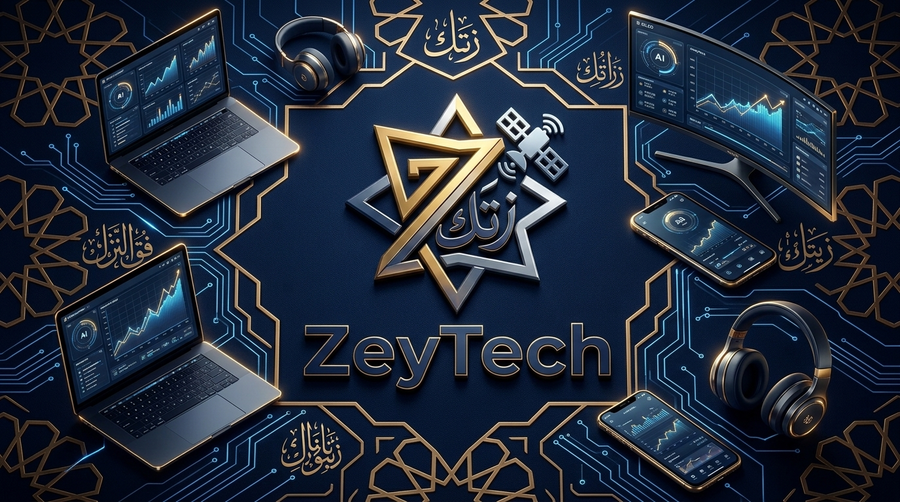

# 🏢 ZeyTech AI Commerce OS
> **Autonomous Multi-Agent Enterprise Commerce Platform with Human-in-the-Loop Governance**

<div align="center">
  
</div>

[](https://www.php.net/)
[](https://mariadb.org/)
[](https://www.docker.com/)
[](https://n8n.io/)
[](file:///scratch/test_deep_suite.js)

---

## 📑 Overview

**ZeyTech AI Commerce OS** is a production-grade, multi-agent autonomous enterprise commerce platform tailored for high-throughput retail operations in the Moroccan and North African markets (headquartered at **Casablanca Central Hub-A1**).

The architecture bridges **agentic AI orchestration (via a 51-node n8n engine)** with a **high-reliability transactional PHP 8.2 / MariaDB backend**, an **interactive customer storefront with a 3D WebGL product studio**, and a **real-time Human-in-the-Loop (HITL) Merchant Operations Console**.

```
                           ┌──────────────────────────────────────────────┐
                           │      OMNICHANNEL INBOUND INGESTION           │
                           │ (Storefront Web Chat, WhatsApp, Telegram)    │
                           └──────────────────────┬───────────────────────┘
                                                  │
                                                  ▼
                           ┌──────────────────────────────────────────────┐
                           │     SECURITY GUARDRAILS & PLATFORM SAFETY    │
                           │  • Prompt Injection Sanitizer                │
                           │  • Sliding-Window Rate Limiter (60 req/min)  │
                           │  • $25.00/Day LLM Budget Guard               │
                           │  • Atomic Event Deduplication (Idempotency)  │
                           └──────────────────────┬───────────────────────┘
                                                  │
                                                  ▼
                           ┌──────────────────────────────────────────────┐
                           │       AI SUPERVISOR & ORCHESTRATION          │
                           │         (n8n Master Workflow Engine)         │
                           │   Ollama Local LLM + Context Memory Buffer   │
                           └──────┬───────────────────────────────┬───────┘
                                  │                               │
         ┌────────────────────────┴──────────────┐ ┌──────────────┴────────────────────────┐
         │     15 SPECIALIZED DOMAIN AGENTS      │ │       CONTROLLED COMMERCE TOOLS      │
         │  • Agent 1: Inbound Router            │ │  • Tool 1: Product Catalog Grounding │
         │  • Agent 2: Conversational Sales      │ │  • Tool 2: 3-State Inventory Lock    │
         │  • Agent 3: Technical Product Expert  │ │  • Tool 3: 6-Digit OTP Verification  │
         │  • Agent 4: AI Recommendations       │ │  • Tool 4: State-Safe Exceptions     │
         │  • Agent 5: Order & Logistics         │ └──────────────────────────────────────┘
         │  • Agent 6: Inventory Guard           │
         │  • Agent 7: Dynamic Pricing & Bundles │
         │  • Agent 8: Marketing Campaigns       │
         │  • Agent 9: Customer Support          │
         │  • Agent 10: Demand Forecasting       │
         │  • Agent 11: Fraud Detection Engine   │
         │  • Agent 12: CRM & Retention          │
         │  • Agent 13: Content Generation       │
         │  • Agent 14: Admin Copilot            │
         │  • Agent 15: Outbound Dispatcher      │
         └───────────────────────────────────────┘
                                  │
                                  ▼
                           ┌──────────────────────────────────────────────┐
                           │      SUPERVISOR OUTPUT EVALUATOR & HITL      │
                           │  Confidence ≥ 0.70 ──► Instant AI Dispatch   │
                           │  Confidence < 0.70 ──► Support Queue Claim   │
                           │  Amount ≥ 5,000 MAD ─► Manager Approval Gate │
                           └──────────────────────┬───────────────────────┘
                                                  │
                                                  ▼
                           ┌──────────────────────────────────────────────┐
                           │       HUMAN MERCHANT OPERATIONS CONSOLE      │
                           │   • Real-Time Server-Sent Events (SSE)       │
                           │   • Manager Authorization (> 5,000 MAD)      │
                           │   • Two-Way Live Chat Drawer (Darija/French) │
                           │   • Immutable Audit Ledger                   │
                           └──────────────────────────────────────────────┘
```

---

## ✨ Key Capabilities

- **15 Specialized Domain Agents + Supervisor:** Grounded catalog sales, *Fiche Technique* hardware comparisons, RFM customer segmentation, predictive demand forecasting, fraud risk scoring, and dynamic multi-product bundle formulation.
- **Moroccan Darija & Multilingual NLP:** Grounded sales assistant fluent in Moroccan Darija, French, and English with exact Moroccan market pricing in Moroccan Dirhams (**MAD**), Euros (**EUR**), and **USD**.
- **Omnichannel Ingestion:** Native Webhooks for WhatsApp Business Cloud API (`api-whatsapp-webhook.php`), Telegram Bot API (`api-telegram-webhook.php`), and Web storefront chat.
- **Human-in-the-Loop (HITL) Operations Console:** High-density SaaS console with live Server-Sent Events (SSE), double-claim mutex protection for support tickets, and manager approval gates for orders $> 5,000\text{ MAD}$.
- **3-State Concurrency Inventory System:** Row-level atomic reservation locks (`available_qty`, `reserved_qty`, `sold_qty`) preventing overselling and deadlocks under heavy concurrency.
- **Domestic Moroccan Logistics:** Automated multi-carrier rate calculation and waybill tracking for **CTM Messagerie**, **Amana Express**, and **Aramex Morocco**.
- **Cryptographic Security & Safety:** HMAC-SHA256 webhook settlement, sliding-window rate limiting (60 req/min), $25/day LLM spend ceiling, and atomic idempotency gates.
- **Interactive 3D Product Studio:** Three.js WebGL viewport for 360° interactive hardware inspection.

---

## 🗂️ Project Structure

```
.
├── docker-compose.yml              # Container definitions (Web, DB, PMA, n8n)
├── Dockerfile                      # PHP 8.2 Apache production image
├── .env.example                    # Environment variable configuration template
├── README.md                       # Master project overview & quickstart
├── PROJECT_DESCRIPTION.md          # Comprehensive architectural specification
│
├── shopping/                       # Core PHP/MariaDB Transactional Platform
│   ├── assets/css/                 # Authentic ZeyTech Brand Design System
│   ├── includes/                   # DB connection pool, security & auth helpers
│   ├── admin/productimages/        # High-resolution vector & photography assets
│   ├── api-chat.php                # Grounded AI sales agent & spec inspection
│   ├── api-whatsapp-webhook.php    # WhatsApp Business Cloud API handler
│   ├── api-telegram-webhook.php    # Telegram Bot API webhook handler
│   ├── api-outbound-dispatch.php   # Agent 15 outbound notification engine
│   ├── api-coupon-apply.php        # Dynamic promo & voucher validator
│   ├── api-inventory-reserve.php   # 3-state atomic inventory lock
│   ├── api-ops-queues.php          # Real-time HITL queue feed & SSE
│   ├── api-payment-verify.php      # HMAC-SHA256 payment verification
│   ├── index.php                   # Modern 2026 Customer Storefront
│   ├── product-details.php         # 3D Studio, specs & Moroccan shipping
│   ├── track-orders.php            # 5-step domestic parcel tracking
│   ├── zeytech-ops-console.html    # Enterprise HITL Merchant Operations Console
│   └── zeytech-platform.php        # 15-Agent manifest & real-time telemetry
│
├── sql/                            # Database Migrations & Seeds
│   ├── shopping.sql                # Base schema (16 tables)
│   └── seed_catalog_48_products.sql# 48 realistic products & 3-state inventory
│
├── n8n/                            # AI Orchestration & Workflows
│   └── zeytech_master_ai_commerce_os.json # 51-node master workflow canvas
│
└── scratch/                        # Automated Verification Test Suites
    ├── test_deep_suite.js          # 42-assertion deep regression suite
    ├── test_live_scenarios_and_stress.js # Multi-agent scenario & stress runner
    ├── verify_seeded_catalog.js    # Fiche Technique spec query suite
    ├── test_responsive_loop.js     # Responsive design breakpoint loop
    └── verify_brand_system.js      # Brand design system compliance auditor
```

---

## 🚀 Quick Start

### 1. Prerequisites
- [Docker](https://www.docker.com/) & Docker Compose
- [Node.js](https://nodejs.org/) (v18+) for running verification suites

### 2. Launch the Stack
```bash
# Clone the repository
git clone https://github.com/soubaibiomar/E-Commerce.git
cd E-Commerce

# Copy environment template
cp .env.example .env

# Start all microservices in background
docker compose up -d --build
```

### 3. Verify Database Seeding
Import the complete catalog and inventory dataset:
```bash
docker exec -i shopping_db mariadb -u root -proot_password_123 shopping < sql/seed_catalog_48_products.sql
```

---

## 🌐 Port Directory & Access Credentials

| Service / Interface | URL | Credentials / Notes |
| :--- | :--- | :--- |
| **🛍️ Modern Storefront** | [http://localhost:8085/index.php](http://localhost:8085/index.php) | Customer store, 48 SKUs, multi-currency, 3D Studio, Darija AI chat |
| **🔍 Domestic Parcel Tracking** | [http://localhost:8085/track-orders.php?tr=CTM-MA-8849102](http://localhost:8085/track-orders.php?tr=CTM-MA-8849102) | Real-time CTM, Amana & Aramex shipment timeline |
| **🛡️ Merchant Operations Console** | [http://localhost:8085/zeytech-ops-console.html](http://localhost:8085/zeytech-ops-console.html) | **Admin:** `admin@zeytech.com` / `AdminPassword2026!`<br>**Manager:** `manager@zeytech.com` / `ManagerPassword2026!`<br>**Support:** `support@zeytech.com` / `SupportPassword2026!` |
| **📊 Multi-Agent Telemetry** | [http://localhost:8085/zeytech-platform.php](http://localhost:8085/zeytech-platform.php) | Financial metrics, supervisor ledger, 15-agent status roster |
| **⚡ Master n8n Orchestrator** | [http://localhost:5678/](http://localhost:5678/) | 51-node workflow engine with 4 execution spines |
| **🗄️ Database Management** | [http://localhost:8086/](http://localhost:8086/) | phpMyAdmin (`root` / `root_password_123`) |

---

## 🧪 Running the Verification Test Suites

```bash
# Run Deep System Verification (42 assertions)
node scratch/test_deep_suite.js

# Run Multi-Channel Scenarios & Concurrency Stress Test (13 assertions)
node scratch/test_live_scenarios_and_stress.js

# Run Catalog Specification & Fiche Technique Query Tests (5 assertions)
node scratch/verify_seeded_catalog.js

# Run Responsive Design Breakpoint Suite (28 assertions)
node scratch/test_responsive_loop.js
```

---

## 📄 License
Distributed under the MIT License. See `LICENSE` for details.
