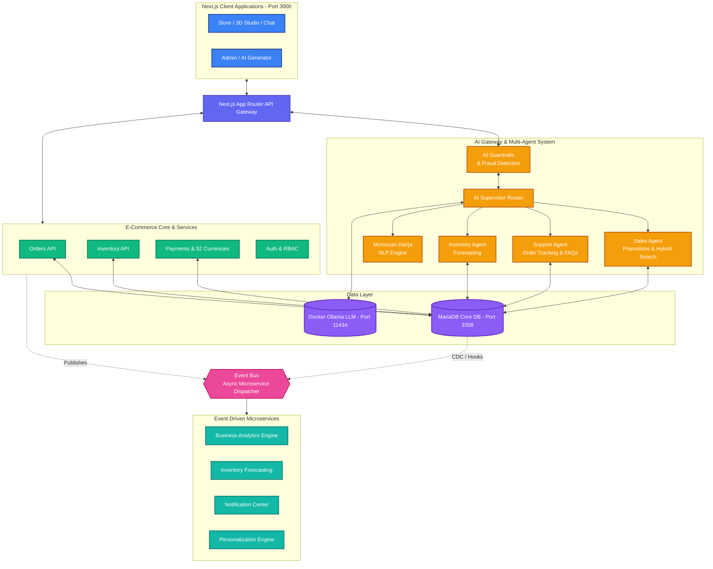

# The Master Architecture: Loop Engineering

## Executive Overview
The **Loop Engineering Platform** is an enterprise-grade, event-driven, multi-agent AI eCommerce ecosystem designed for ultra-fast, modern commerce with photorealistic 3D WebGL inspection, sub-second hybrid search, and local AI reasoning.

---

## 1. System Architecture Diagram

---

## 2. The 16 Pillars & Implementation Map

| Pillar | Implementation | Key Files |
| :--- | :--- | :--- |
| **1. Multi-Agent AI System** | AI Supervisor routes to Sales, Support, Inventory | [`loop-app/lib/agents/supervisor.ts`](file:///d:/Online%20Shopping/loop-app/lib/agents/supervisor.ts) |
| **2. Event-Driven Architecture** | Async Event Bus (`ORDER_CREATED`, `AI_QUERY_LOGGED`) | [`loop-app/lib/events/eventBus.ts`](file:///d:/Online%20Shopping/loop-app/lib/events/eventBus.ts) |
| **3. Personalization & Analytics** | Event subscribers log AI query metrics & interest | [`loop-app/lib/events/eventBus.ts`](file:///d:/Online%20Shopping/loop-app/lib/events/eventBus.ts) |
| **4. Hybrid Search** | Keyword + Specs + Category Scoring Engine | [`loop-app/app/api/search/hybrid/route.ts`](file:///d:/Online%20Shopping/loop-app/app/api/search/hybrid/route.ts) |
| **5. Multimodal Search** | 3D WebGL mesh viewer & visual attributes | [`loop-app/components/Product3DStudio.tsx`](file:///d:/Online%20Shopping/loop-app/components/Product3DStudio.tsx) |
| **6. Deterministic Pricing** | Mathematical conversions across 52 currencies | [`loop-app/lib/currency.ts`](file:///d:/Online%20Shopping/loop-app/lib/currency.ts) |
| **7. Moroccan Localization** | Native Darija NLP (`"بغيت شي تلفاز مزيان"`), MAD pricing | [`loop-app/lib/agents/supervisor.ts`](file:///d:/Online%20Shopping/loop-app/lib/agents/supervisor.ts) |
| **8. Enterprise Core & ORM** | Prisma ORM mapping to MariaDB (`localhost:3308`) | [`loop-app/prisma/schema.prisma`](file:///d:/Online%20Shopping/loop-app/prisma/schema.prisma) |
| **9. 3D PBR WebGL Studio** | Three.js orbit, zoom, 5 material finishes, lighting | [`loop-app/components/Product3DStudio.tsx`](file:///d:/Online%20Shopping/loop-app/components/Product3DStudio.tsx) |
| **10. Local Privacy AI (Ollama)**| Docker Ollama container (`llama3.2:1b`, `qwen3:8b`) | [`loop-app/app/api/chat/route.ts`](file:///d:/Online%20Shopping/loop-app/app/api/chat/route.ts) |
| **11. Visual Automation (n8n)** | n8n Webhook Proxy & workflow JSON configs | [`d:/Online Shopping/n8n/`](file:///d:/Online%20Shopping/n8n/) |
| **12. Fiche Technique Engine** | Verified structured hardware parameters table | [`loop-app/components/FicheTechniqueTable.tsx`](file:///d:/Online%20Shopping/loop-app/components/FicheTechniqueTable.tsx) |
| **13. AI Spec Auto-Generator** | Admin AI Suite for instant specification generation | [`loop-app/app/admin/ai-generator/page.tsx`](file:///d:/Online%20Shopping/loop-app/app/admin/ai-generator/page.tsx) |
| **14. SEO & GEO Optimization** | JSON-LD schema (Product, Offer, Org) + Answer-First | [`shopping/includes/seo.php`](file:///d:/Online%20Shopping/shopping/includes/seo.php) |
| **15. Dual-Stack Co-existence** | Next.js on port 3000 & PHP/Docker on port 8085 | Seamlessly sharing same database |
| **16. Security & Guardrails** | SQL injection prevention and input sanitization | Built into Supervisor & Prisma |
